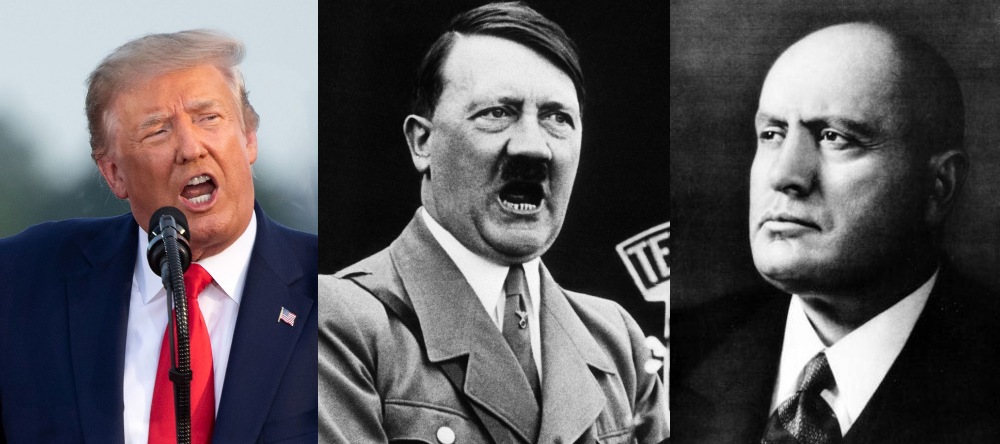

<br>
<center>{width=80%}</center>
<center>***Donald Trump, Adolf Hitler, and Benito Mussolini***</center>
<br>

```{r setup, include=FALSE}
knitr::opts_chunk$set(echo = FALSE)

# Attach packages
library(tidyverse)
library(tidytext)
library(textdata)
library(pdftools)
library(ggwordcloud)
library(here)
```

## Overview

The following report is an exploratory analysis into fascist rhetoric. Using text analysis and subsequent visualizations (word clouds, column graphs), this report analyzes the language used from three different speeches:

- Adolf Hitler's speech to the Reichstag in 1939
- Donald Trump's state of the union address in 2020
- Benito Mussolini's declaration of dictatorship in 1925

In addition, the report conducts a sentiment analysis using a predetermined lexicon to analyze the tone of the speeches. Finally, the speeches are compared to see if any trends can be deduced among these leaders commonly referred to as 'fascists'. 

```{r}
# Read in the PDFs of the speeches
hitler_text <- pdf_text('hitler_speech.pdf')
trump_text <- pdf_text('trump_speech.pdf')
mussolini_text <- pdf_text('mussolini_speech.pdf')

# Storing the Hitler speech as a dataframe
hitler_lines <- data.frame(hitler_text) %>% 
  mutate(page = 1:n()) %>%
  mutate(text_full = str_split(hitler_text, pattern = '\\n')) %>% 
  unnest(text_full) %>% 
  mutate(text_full = str_trim(text_full)) 

# Storing the Trump speech as a dataframe
trump_lines <- data.frame(trump_text) %>% 
  mutate(page = 1:n()) %>%
  mutate(text_full = str_split(trump_text, pattern = '\\n')) %>% 
  unnest(text_full) %>% 
  mutate(text_full = str_trim(text_full)) 

# Storing the Mussolini speech as a dataframe
mussolini_lines <- data.frame(mussolini_text) %>% 
  mutate(page = 1:n()) %>%
  mutate(text_full = str_split(mussolini_text, pattern = '\\n')) %>% 
  unnest(text_full) %>% 
  mutate(text_full = str_trim(text_full)) 

# Creating a dataframe with words from the Hitler speech
hitler_words <- hitler_lines %>% 
  unnest_tokens(word, text_full) %>% 
  select(-hitler_text) 

# Creating a dataframe with words from the Trump speech
trump_words <- trump_lines %>% 
  unnest_tokens(word, text_full) %>% 
  select(-trump_text)

# Creating a dataframe with words from the Mussolini speech
mussolini_words <- mussolini_lines %>% 
  unnest_tokens(word, text_full) %>% 
  select(-mussolini_text)

# Removing stop_words
hitler_words_clean <- hitler_words %>% 
  anti_join(stop_words, by = 'word')

# Removing stop_words
trump_words_clean <- trump_words %>% 
  anti_join(stop_words, by = 'word')

# Removing stop_words
mussolini_words_clean <- mussolini_words %>% 
  anti_join(stop_words, by = 'word')

# Getting the counts for the words
hitler_nonstop_counts <- hitler_words_clean %>% 
  count(word)

# Getting the counts for the words
trump_nonstop_counts <- trump_words_clean %>% 
  count(word)

# Getting the counts for the words
mussolini_nonstop_counts <- mussolini_words_clean %>% 
  count(word)

# Getting the top 30 words by count for the column graph
top_30_words_hitler <- hitler_nonstop_counts %>% 
  arrange(-n) %>% 
  slice(1:30) %>%
  mutate(word = fct_reorder(word,n)) %>% 
  ungroup() 

# Getting the top 30 words by count for the column graph
top_30_words_trump <- trump_nonstop_counts %>% 
  arrange(-n) %>% 
  slice(1:30) %>%
  mutate(word = fct_reorder(word,n)) %>% 
  ungroup() 

# Getting the top 30 words by count for the column graph
top_30_words_mussolini <- mussolini_nonstop_counts %>% 
  arrange(-n) %>% 
  slice(1:30) %>%
  mutate(word = fct_reorder(word,n)) %>% 
  ungroup() 

# Getting the top 50 words by count for the word cloud
top_50_words_hitler <- hitler_nonstop_counts %>% 
  arrange(-n) %>% 
  slice(1:50) %>% 
  ungroup() 

# Getting the top 50 words by count for the word cloud
top_50_words_trump <- trump_nonstop_counts %>% 
  arrange(-n) %>% 
  slice(1:50) %>% 
  ungroup() 

# Getting the top 50 words by count for the word cloud
top_50_words_mussolini <- mussolini_nonstop_counts %>% 
  arrange(-n) %>% 
  slice(1:50) %>% 
  ungroup() 
```

## Word Count Analysis {.tabset .tabset-fade}

Below we use word clouds and column graphs to visualize the most common words used across these three speeches. Then we do a qualitative comparison to look for similarities among the speeches.

### Hitler Speech Analysis {.tabset .tabset-pills}

#### Word Cloud

```{r, fig.align='center'}
speech_cloud_hitler <- ggplot(data = top_50_words_hitler, aes(label = word)) + 
  geom_text_wordcloud(aes(color = n, size = n), shape = "circle") + # mapping aesthetics by number of counts
  scale_size_area(max_size = 10) + # limiting the size of the biggest words
  scale_color_gradientn(colors = c("#705bad","#2d1b63")) + # custom colors
  theme_minimal() + # choosing a theme
  labs(title = "Hitler's Speech to the Reichstag (1939)") + # title and formatting
  theme(plot.title = element_text(hjust = 0.5,
                                  size = 20))

speech_cloud_hitler
```

<center>**Figure 1.** Word cloud showing the most common words in Hitler's 1939 speech to the Reichstag. Nationalistic words such as "Germany" and "German" are most used.</center>

#### Column Graph

```{r, fig.align='center'}
col_graph_hitler <- ggplot(data = top_30_words_hitler, aes(x = word, y = n)) +
  geom_col(color = "#705bad", fill = "#2d1b63", alpha = 0.9) + # creating the column graph
  theme_minimal() + # choosing a theme
  labs(x = "Word", # labels
       y = "Count") +
  theme() +
  coord_flip() # flipping the coordinates

col_graph_hitler
```

<center>**Figure 2.** Column graph showing the most common words in Hitler's 1939 speech to the Reichstag. Nationalistic words such as "Germany" and "German" are used a total of 35 times, which is significantly more than others.</center>

### Trump Speech Analysis {.tabset .tabset-pills}

#### Word Cloud

```{r, fig.align='center'}
speech_cloud_trump <- ggplot(data = top_50_words_trump, aes(label = word)) +
  geom_text_wordcloud(aes(color = n, size = n), shape = "circle") + # mapping aesthetics by number of counts
  scale_size_area(max_size = 10) + # limiting the size of the biggest words
  scale_color_gradientn(colors = c("#705bad","#2d1b63")) + # custom colors
  theme_minimal() + # choosing a theme
  labs(title = "Trump's State of the Union Address (2020)", # title and formatting
       size = 12) +
  theme(plot.title = element_text(hjust = 0.5,
                                  size = 20))

speech_cloud_trump
```

<center>**Figure 3.** Word cloud showing the most common words in Trump's 2020 state of the union address. Nationalistic words such as "America" and "American" are most used.</center>

#### Column Graph

```{r, fig.align='center'}
col_graph_trump <- ggplot(data = top_30_words_trump, aes(x = word, y = n)) + # creating the column graph
  geom_col(color = "#705bad", fill = "#2d1b63", alpha = 0.8) +
  theme_minimal() + # choosing a theme
  labs(x = "Word", # labels
       y = "Count") +
  theme() +
  coord_flip() # flipping the coordinates

col_graph_trump
```

<center>**Figure 4.** Column graph showing the most common words in Trump's 2020 state of the union address. Nationalistic words such as "America", "American", "Americans" far surpass other words with a combined count over 50 times.</center>

### Mussolini Speech Analysis {.tabset .tabset-pills}

#### Word Cloud

```{r, fig.align='center'}
speech_cloud_mussolini <- ggplot(data = top_50_words_mussolini, aes(label = word)) +
  geom_text_wordcloud(aes(color = n, size = n), shape = "circle", rm_outside = TRUE) + # mapping aesthetics by number of counts
  scale_size_area(max_size = 9) + # limiting the size of the biggest words
  scale_color_gradientn(colors = c("#705bad","#2d1b63")) + # custom colors
  theme_minimal() + # choosing a theme
  labs(title = "Mussolini's Declaration of Dictatorship (1925)", # title and formatting
       size = 12) +
  theme(plot.title = element_text(hjust = 0.5,
                                  size = 20))

speech_cloud_mussolini
```

<center>**Figure 5.** Word cloud showing the most common words in Mussolini's 1925 declaration of dictatorship to the Italian parliament. Words such as "government", "speech", "fascists", "gentleman", are common.</center>

#### Column Graph

```{r, fig.align='center'}
col_graph_mussolini <- ggplot(data = top_30_words_mussolini, aes(x = word, y = n)) + # creating the column graph
  geom_col(color = "#705bad", fill = "#2d1b63", alpha = 0.8) +
  theme_minimal() + # choosing a theme
  labs(x = "Word", # labels
       y = "Count") +
  theme() +
  coord_flip() # flipping the coordinates

col_graph_mussolini
```

<center>**Figure 6.** Column graph showing the most common words in Mussolini's 1925 declaration of dictatorship to the Italian parliament. Words such as "government", "speech", "fascists", "gentleman", are common.</center>

## Sentiment Analysis {.tabset .tabset-fade}

```{r}
# Adding a column with afinn sentiment to the dataframe
hitler_afinn <- hitler_words_clean %>% 
  inner_join(get_sentiments("afinn"), by = 'word') 

# Adding a column with afinn sentiment to the dataframe
trump_afinn <- trump_words_clean %>% 
  inner_join(get_sentiments("afinn"), by = 'word')

# Adding a column with afinn sentiment to the dataframe
mussolini_afinn <- mussolini_words_clean %>% 
  inner_join(get_sentiments("afinn"), by = 'word')

# Finding the mean of the afinn score
hitler_afinn_counts <- hitler_afinn %>% 
  count(value)

hitler_afinn_mean <- hitler_afinn %>% 
  summarize(mean_afinn = round(mean(value),2))

# Finding the mean of the afinn score
trump_afinn_counts <- trump_afinn %>% 
  count(value)

trump_afinn_mean <- trump_afinn %>% 
  summarize(mean_afinn = round(mean(value),2))

# Finding the mean of the afinn score
mussolini_afinn_counts <- mussolini_afinn %>% 
  count(value)

mussolini_afinn_mean <- mussolini_afinn %>% 
  summarize(mean_afinn = round(mean(value),2))

# Creating a dataframe with the afinn mean for each speech
fascist_afinn <- data.frame(hitler_afinn_mean, trump_afinn_mean, mussolini_afinn_mean) %>% 
  pivot_longer(cols = 1:3, values_to = "afinn", names_to = "fascist") %>% 
  mutate(fascist_afinn = case_when(
    fascist == "mean_afinn" ~ "Hitler 1939",
    fascist =="mean_afinn.1" ~ "Trump 2020",
    fascist == "mean_afinn.2" ~ "Mussolini 1925"
  ))
```


```{r, fig.align='center'}
# Afinn visualization

afinn <- ggplot(data = fascist_afinn, aes(x = fascist_afinn, y = afinn)) +
  geom_col(width = 0.5, color = "purple4", fill = "purple3", alpha = 0.9) +
  scale_y_continuous(limits = c(-5,5)) + # changing y axis to reflect
  theme_minimal() +
  theme(legend.position = "none") + 
  labs(x = element_blank(), y = "Afinn Sentiment Value\n") + # labeling axes
  geom_text(aes(label = afinn), # adding text labels to columns
            size = 8,
            vjust = -1.5) +
  geom_text(aes(x = 2, y =5), # adding text 
            label = "Positive sentiment",
            size = 5) +
  geom_text(aes(x = 2, y =-5), 
            label = "Negative sentiment",
            size = 5) +
  geom_hline(yintercept = 0)  # Adding a horizontal line to mark neutral sentiment

afinn
```

<center>**Figure 7.** Column graph showing the mean afinn scores for the three speeches. Hitler's speech has a very slight negative sentiment (-0.17), Mussolini's is significantly more negative (-0.72), and Trump's has a positive sentiment (0.38).</center>

## Summary

Results show some interesting trends among the speeches. Analyzing the word clouds and column graphs we can see similarities between Trump and Hitler's speeches. Both prioritize nationalistic rhetoric focusing on words related to their countries. Both show frequent usage of words that "other" individuals such as "Polish" for Hitler and "illegal" for Trump. 

In contrast, Mussolini's text analysis is much more openly fascist. Instead of focusing on positive nationalistic rhetoric, Mussolini is declaring his dictatorship, calling out "subversives" and looking to assert his dominance, explaining the difference between his speech and the other two.

Looking at the sentiment analysis, the only clear trend is the negative sentiment Mussolini's speech. This makes sense given the words (e.g. fascist, wounded, revolt, militia, attacked, etc.). Trump and Hitler's speeches are closer to neutral. Additional analysis would be needed to draw clear conclusions from these speeches. It would be interesting to look at speeches among other fascists, as well as comparing speeches from one leader throughout time.

#### Data Citation:
"Adolf Hitler Speech January 30, 1939" Accessed March 13, 2022. <https://www.worldfuturefund.org/Articles/Hitler/hitler1939.html>.

"Read the full text of Trump’s 2020 State of the Union" PBS. Feb 6, 2020. Accessed March 13, 2022. <https://www.pbs.org/newshour/politics/read-the-full-text-of-trumps-2020-state-of-the-union>.

"Speech to the Italian parliament" Accessed March 13, 2022.
<https://www.marxists.org/archive/gramsci/1925/05/speech.html>
