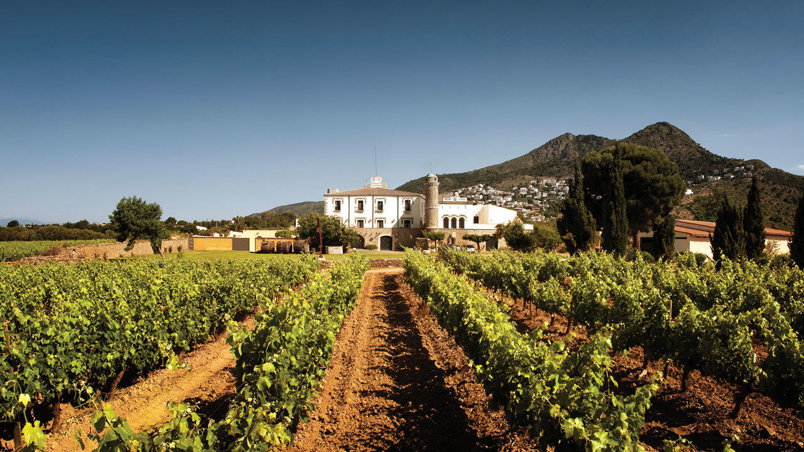

<br>
<center>{width=100%}</center>

<center>***Coll de Roses, a wine estate in Spain with 98 acres of vines //
CHRISTIE'S INTERNATIONAL REAL ESTATE***</center>

<br>

```{r setup, include=FALSE, message = FALSE, warning = FALSE}
knitr::opts_chunk$set(echo = FALSE, message = FALSE, warning = FALSE, fig.align='center')
 
library(tidyverse)
library(janitor)
library(here)
library(ggfortify) # For biplot
library(patchwork)
library(gghighlight) # For useful highlighting
library(lubridate) # For easier dates & times
library(plotly) # Interactive graphs
library(dash)
```

## A versatile beverage

Wine is a versatile beverage that is consumed across the globe. This analysis looks at what factors influence "high quality" wine as rated by experts. To accomplish this, the analysis below uses **principal components analysis** (PCA) to explore the relationships between predictor variables and quality. The data includes variables such as concentration of alcohol, sulfur, phosphates, chlorides, citric acid, and more. Moreover, this analysis is applied to both red and white wine, and the results are compared to see if there are different predictor variables leading to higher quality between the two varieties.


```{r data}
# Read in the wine data
wine <- read_csv(here('wine.csv')) %>% 
  clean_names() %>% # Convert to lowercase snake
  rename(ph = p_h) # Rename the ph column

# Filter for red wine
wine_red <- wine %>% 
  filter(type == "red")

# Filter for white wine
wine_white <- wine %>% 
  filter(type == "white")
```

## Red wine analysis {.tabset .tabset-fade}
```{r}
# Creating a pca subset
wine_red_pca <- wine_red %>%
  select(-type) %>% 
  scale() %>%
  prcomp()
```

### PCA biplot: 1 & 2
```{r}
# Creating a biplot using autoplot
autoplot(wine_red_pca,
         x = 1,
         y = 2,
         data = wine_red,
         colour = 'quality',
         loadings = TRUE,
         loadings.label = TRUE,
         loadings.colour = "black",
         loadings.label.colour = "black",
         loadings.label.vjust = -0.5,
         loadings.label.size = 3.5
         ) +
  labs(colour = "Quality") +
  scale_colour_stepsn(colours = c("#ffffb3","#ebcc84","#d39a60","#b86a47","#963a36","#70002a"), 
                      n.breaks = 7,
                      limits = c(3,9)) +
  theme_minimal()
```

<center>**Figure 1a.** Visualization of principal components 1 & 2 for the red wine data. Graphic shows little interaction between variables such as sulfur dioxide and pH. Sulfur-related predictors significantly influence PC2, while acidity, sulphates and pH have strong effects on PC1. We can see sulfur content has the opposite effect on PC2 compared to alcohol and wine quality.</center> 


### PCA biplot: 3 & 4 
```{r}
# Creating a biplot using autoplot
autoplot(wine_red_pca,
         x = 3,
         y = 4,
         data = wine_red,
         colour = 'quality',
         loadings = TRUE,
         loadings.label = TRUE,
         loadings.colour = "black",
         loadings.label.colour = "black",
         loadings.label.vjust = -0.5,
         loadings.label.size = 3.5
         ) +
  labs(colour = "Quality") +
  scale_colour_stepsn(colours = c("#ffffb3","#ebcc84","#d39a60","#b86a47","#963a36","#70002a"), 
                      n.breaks = 7,
                      limits = c(3,9)) +
  theme_minimal()
```

<center>**Figure 1b.** Visualization of principal components 3 & 4 for the red wine data. Graphic shows little interaction between variables such as sulfur dioxide and chlorides. Sulfur-related predictors significantly influence PC3, while chlorides, and sulphates (less so) have strong effects on PC4. Variables such as quality have little to no influence on these components.</center> 

### Screeplot
```{r}
# Creating the vectors
sd_vec <- wine_red_pca$sdev
var_vec <- sd_vec^2 
pc_names <- colnames(wine_red_pca$rotation)
 
# Creating the variance dataframe
pct_expl_df <- data.frame(v = var_vec,
                          pct_v = var_vec / sum(var_vec),
                          pc = fct_inorder(pc_names)) %>%
  mutate(pct_lbl = paste0(round(pct_v*100, 1), '%'))
 
# Graphing the screeplot
ggplot(pct_expl_df, aes(x = pc, y = v)) +
  theme_minimal()+
  geom_col(color = "#54001f", fill = '#70002a', alpha = 0.9) +
  geom_text(aes(label = pct_lbl), vjust = 0, nudge_y = .015) +
  labs(x = '\nPrincipal component', y = 'Variance explained\n')
```

<center>**Figure 1c.** Screeplot for the red wine data. We can see PC1 accounts for 26% of variance, while PC2 accounts for approximately 19%. After PC5, the remaining components tend to account for ~5% variance or less.</center> 

## White wine analysis {.tabset .tabset-fade}
```{r}
# Creating a pca subset
wine_white_pca <- wine_white %>%
  select(-type) %>% 
  scale() %>%
  prcomp()
```

### PCA biplot: 1 & 2
```{r}
# Creating a biplot using autoplot
autoplot(wine_white_pca,
         x = 1,
         y = 2,
         data = wine_white,
         colour = 'quality',
         loadings = TRUE,
         loadings.label = TRUE,
         loadings.colour = "black",
         loadings.label.colour = "black",
         loadings.label.vjust = -0.4,
         loadings.label.size = 3.5
         ) +
  labs(colour = "Quality") +
  scale_colour_stepsn(colours = c("#f2ff20","#c4e01d","#9ac01a","#74a117","#518213","#32640d","#154706"),
                      n.breaks = 6,
                      limits = c(3,10)) +
  theme_minimal()
```

<center>**Figure 2a.** Visualization of principal components 1 & 2 for the white wine data. Graphic shows little interaction between variables such as alcohol and pH. Alcohol, density, and sugar significantly influence PC1, while pH, and fixed acidity have strong effects on PC1. We can see fixed acidity has the opposite effect on on the components compared to pH.</center>


### PCA biplot: 3 & 4 
```{r}
# Creating a biplot using autoplot
autoplot(wine_white_pca,
         x = 3,
         y = 4,
         data = wine_white,
         colour = 'quality',
         loadings = TRUE,
         loadings.label = TRUE,
         loadings.colour = "black",
         loadings.label.colour = "black",
         loadings.label.vjust = -0.5,
         loadings.label.size = 3.5
         ) +
 labs(colour = "Quality") +
  scale_colour_stepsn(colours = c("#f2ff20","#c4e01d","#9ac01a","#74a117","#518213","#32640d","#154706"),
                      n.breaks = 6,
                      limits = c(3,10)) +
  theme_minimal()
```

<center>**Figure 2b.** Visualization of principal components 3 & 4 for the white wine data. Graphic shows little interaction between variables such as chlorides and volatile acidity. Most variables effect both components, with volatile acidity influencing PC3 the most, while chlorides and sulphates appear to influence PC4 the most.</center> 

### Screeplot
```{r}
# Creating the vectors
sd_vec2 <- wine_white_pca$sdev
var_vec2 <- sd_vec2^2 
pc_names2 <- colnames(wine_white_pca$rotation)
 
# Creating the variance dataframe
pct_expl_df2 <- data.frame(v2 = var_vec2,
                          pct_v2 = var_vec2 / sum(var_vec2),
                          pc2 = fct_inorder(pc_names2)) %>%
  mutate(pct_lbl2 = paste0(round(pct_v2*100, 1), '%'))
 
# Graphing the screeplot
ggplot(pct_expl_df2, aes(x = pc2, y = v2)) +
  theme_minimal()+
  geom_col(color = "#3c6d0e", fill = '#8abf14', alpha = 0.9) +
  geom_text(aes(label = pct_lbl2), vjust = 0, nudge_y = .015) +
  labs(x = '\nPrincipal component', y = 'Variance explained\n')
```

<center>**Figure 1c.** Screeplot for the white wine data. We can see PC1 accounts for ~28% of variance, while PC2 accounts for approximately 13%. After PC9, the remaining components tend to account for ~3% variance or less.</center> 

## Summary of findings

Comparing the two subsets it is interesting to see that sulfur-related variables had the opposite effect on wine quality for the red wine, but this trend did not hold for the white wine. Moreover, the red wine screeplot (Figure 1c) had a greater variance distribution across components than the white wine screeplot (Figure 3c). After PC1, there is a sharp drop off in variance explained for the white wine subset. 

It would be interesting to run additional analyses on this dataset, or to run PCA on a dataset for beer to see what factors influence beer 'quality'. 

#### Data Citation:
P. Cortez, A. Cerdeira, F. Almeida, T. Matos and J. Reis.
Modeling wine preferences by data mining from physicochemical properties. In Decision Support Systems, Elsevier, 47(4):547-553, 2009.

**Relevant Paper**:
P. Cortez, A. Cerdeira, F. Almeida, T. Matos and J. Reis.
Modeling wine preferences by data mining from physicochemical properties. In Decision Support Systems, Elsevier, 47(4):547-553, 2009.


