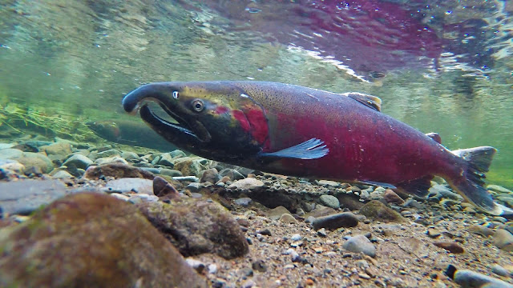

<br>
<center>{width=80%}</center>
<center>***Male Coho salmon showing mating colors // Alamy Stock Photos***</center>
<br>

```{r setup, include=TRUE, message = FALSE, warning = FALSE}
knitr::opts_chunk$set(echo = FALSE, warning = FALSE, message = FALSE)
# attach packages
library(tidyverse)
library(here)
library(lubridate)
library(tsibble)
library(feasts)
library(slider)
library(janitor)
library(paletteer)
```

## Overview

The following report examines Data Access in Real Time (DART) fish passage data observed at the Willamette Falls fish ladder on the Willamette River in Oregon. Counts of three species of salmon (coho, jack coho, and steelhead) were collected from the years 2001-2010. The following report explores this data through time series analysis focusing on daily counts, monthly counts, and annual counts. Through visualizations we explore the data to analyze potential trends among the three species of salmon. 

```{r data}
# Wrangle the data
fish <- read_csv("willamette_fish_passage.csv") %>% # Read in data
  clean_names() %>% # Clean names
  mutate(date = lubridate::mdy(date)) %>% # Make the date usable
  as_tsibble(key = NULL, index = date) %>% # Convert to a tsibble
  select(date, coho, jack_coho, steelhead) # Select the date and fish species

fish[is.na(fish)] <- 0 # Replace NAs with 0

# Create a longer dataset
fish_longer <- fish %>% 
  pivot_longer(cols = 2:4, names_to = "species", values_to = "count") %>% # Pivot longer
  mutate(species = case_when( # Rename species for better visualization
    species == "coho" ~ "Coho",
    species == "jack_coho" ~ "Jack Coho", 
    species == "steelhead" ~ "Steelhead"))

# Create a dataset for counts by month
fish_month <- fish_longer %>% 
  index_by(month = ~yearmonth(.)) %>% # Index by month
  group_by(species) %>% # Group by species
  summarize(monthly_count = mean(count, na.rm = TRUE)) %>% # Find total counts by month
  mutate(year = year(month)) # Create a year column
```

### Map

<br>
<center>.*](fish.png){width=80%}</center>
<center>**Figure 1.** Map of Willamette showing the location of the fish ladder in the Northeast.</center>
<br>

## Analysis {.tabset .tabset-fade}

### Daily Count Series

```{r}
# time series of daily fish passage data
ggplot(data = fish_longer, aes(x = date, y = count, color = species)) +
  geom_line(size = 0.5, alpha = 0.9, show.legend = FALSE) +
  theme_minimal() +
  facet_grid(species ~ .,
             scales = "free") +
  theme(axis.text.x = element_text(vjust = 3)) +
  scale_color_manual(values = c("#0d42ba", "#ffbf00", "#0dba86")) +
  labs(x = "Year", y = "Fish counts per day\n") 
```

**Figure 2.** Daily time series of total adult salmon passage for Coho, Jack Coho, and Steelhead salmon at the Willamette Falls fish ladder between the years of 2001 to 2010. 

Trends appear to stay constant until 2008 where we notice an increase in salmon counts from that point onward. Coho and Jack Coho counts were significantly lower than Steelhead counts overall, and appear to increase near the end of each year. In contrast, Steelhead counts were significantly higher overall and peaked in the first half of each year. For this reason, it is possible Jack Coho and Coho salmon are in competition during the second half of the year. 

### Seasonplots

```{r}
# season plot for each fish species
fish_month %>% 
  gg_season(y = monthly_count, pal = paletteer_c(palette = "scico::imola", n = 10, direction = -1), size = 0.5) +
  theme_minimal() +
  labs(x = "\nMonth", y = "Daily Count") +
  theme(axis.text.x = element_text(size = 10))
```

**Figure 3.** Average monthly total of adult salmon passage for Coho, Jack Coho, and Steelhead salmon for each year at the Willamette Falls fish ladder between the years of 2001 to 2010. 

This visualization supports our observations from the daily count time series. We can see Coho and Jack Coho salmons show increased counts between August to November, peaking around September. In contrast, Steelhead counts peak around May-June and show a general increasing trend from January to June before decreasing significantly from that point on.

### Annual Total
```{r}
# wrangling fish passage data by year
fish_annual <- fish_longer %>% 
  index_by(year = ~year(.)) %>% 
  group_by(species) %>% 
  summarize(yearly_counts = sum(count))
# visualizing annual fish counts
ggplot(data = fish_annual, aes(x = year, y = yearly_counts, color = species)) +  
  geom_line(size = 1, alpha = 0.9) +
  theme_minimal(12) +
  theme(legend.position = c(0.5, 0.95),
        legend.title = element_blank(),
        legend.background = element_rect(fill = "white", size = 0.2),
        legend.text = element_text(size = 10),
        legend.direction = "horizontal",
        axis.text.x = element_text(vjust = 3)) +
  scale_color_manual(values = c("#0d42ba", "#ffbf00", "#0dba86")) +
  labs(x = "Year", y = "Total fish count per year\n") +
  scale_x_continuous(n.breaks = 10) # custom axis breaks
  
```

**Figure 4.** Average annual total of adult salmon passage for Coho, Jack Coho, and Steelhead salmon for each year at the Willamette Falls fish ladder between the years of 2001 to 2010. 

Average annual total counts show a variable trend in Steelhead counts with the overall trend decreasing from 2001 onward until 2009 where counts begin to increase. In contrast, Coho and Jack Coho counts remain relatively stable with slight fluctuations from 2001 until 2008 where we see a sharp increase in Coho counts. 

## Summary

This exploratory analysis of adult salmon passage through the Willamette Falls fish ladder show various trends:

- Steelhead counts are significantly higher than Coho and Jack Coho counts, although the latter two begin to increase from 2008 onward.

- Steelhead counts are highest in the first half of the year, while Coho and Jack Coho counts are highest in the second half.

- Steelhead counts show an overall decreasing trend across years until 2010, Jack Coho counts show a relative stable trend, and Coho counts increase drastically from 2008 onward. 

## Data Citation:
Columbia Basin Research, University of Washington. 2010. DART Adult Passage Graphics & Text. [<http://www.cbr.washington.edu/dart/query/adult_graph_text.>](http://www.cbr.washington.edu/dart/query/adult_graph_text.*)


